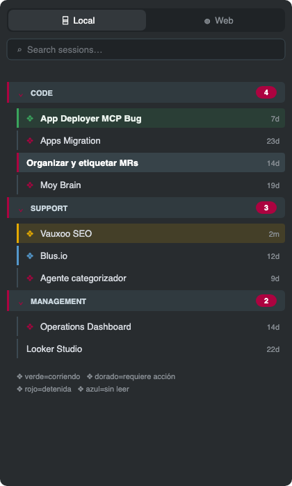
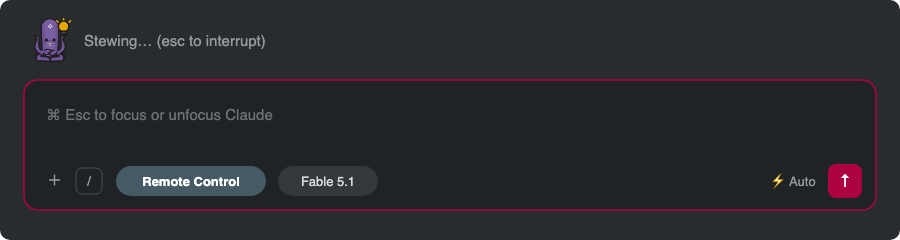
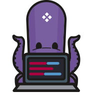

# claude-vauxoo-patch

Parche visual Vauxoo para la extensión de **Claude Code en VSCode**: panel de
sesiones con semántica de actividad, input y acentos en rojo Vauxoo, y
**Vakyro** (mascota interna) como ícono y como indicador animado de "Claude
pensando" (cicla: pensar → escribir → leer → trabajar).

> ⚠️ **Privado / uso interno Vauxoo.** Contiene los assets de Vakyro, cuya
> política de marca es *internal-only*. No hacer público ni redistribuir.
> Se complementa con el theme público
> [vauxoo.vauxoo-theme](https://marketplace.visualstudio.com/items?itemName=vauxoo.vauxoo-theme)
> (Dark / Light / Vakyro), que pinta el resto de VSCode (y gran parte del
> webview de Claude) vía variables `--vscode-*`.

## Resultado

Panel de sesiones con semántica de actividad y el glifo ❖ del isotipo:



Vakyro como indicador de "Claude pensando" (cicla foco → lápiz → libro →
laptop) y el input con el acento rojo Vauxoo:



Los 4 estados del ciclo:

<p>



</p>

*(Renders generados desde los tokens/SVG reales del parche — `docs/*.svg`.)*

## Instalación (macOS)

```sh
git clone git@github.com:oscarolar/claude-vauxoo-patch.git ~/.claude/session-panel-patch
~/.claude/session-panel-patch/install.sh
```

Luego en VSCode: `Cmd+Shift+P` → **Developer: Reload Window**, e instala el
theme: `code --install-extension vauxoo.vauxoo-theme` → `Cmd+K Cmd+T` →
**Vauxoo Dark**.

`install.sh` es idempotente: aplica el CSS + íconos y deja un LaunchAgent
(`com.oscarolar.claude-session-panel-patch`) que re-aplica el parche
automáticamente cada vez que la extensión de Claude Code se actualiza (los
updates sobreescriben sus archivos). Aun así, tras un update hay que recargar
la ventana para que el webview tome el CSS.

## Actualizar

```sh
cd ~/.claude/session-panel-patch && git pull && ./apply.sh
```

## Desinstalar

```sh
~/.claude/session-panel-patch/apply.sh --remove
```

Restaura el CSS original, los íconos originales de Claude (respaldos `.orig`)
y desinstala el LaunchAgent.

## Qué toca y cómo

| Pieza | Mecanismo |
|---|---|
| Panel de sesiones (grupos, estados, glifo ❖) | Bloque CSS anexado a `webview/index.css` entre marcadores `CC-SESSION-PANEL-PATCH` |
| Input/acentos rojo Vauxoo | Override de variables `--app-claude-*` en `html{}` (van al final del archivo, ganan en cascada) |
| Vakyro animado al pensar | El span `icon_*` del spinner se vuelve transparente y se pinta Vakyro como fondo (4 data-URIs ciclados por `@keyframes`) |
| Íconos (activity bar, pestañas, logo) | Reemplazo de archivos en `resources/` con respaldo `.orig` |

Semántica de estados en el panel: **verde** = agente corriendo (pulsa),
**dorado** = requiere al usuario, **rojo tenue** = detenida, **azul** = sin leer.

Ver `AGENTS.md` para mantenimiento asistido por agentes (qué verificar cuando
un update de la extensión rompe un selector, cómo regenerar los data-URIs).
